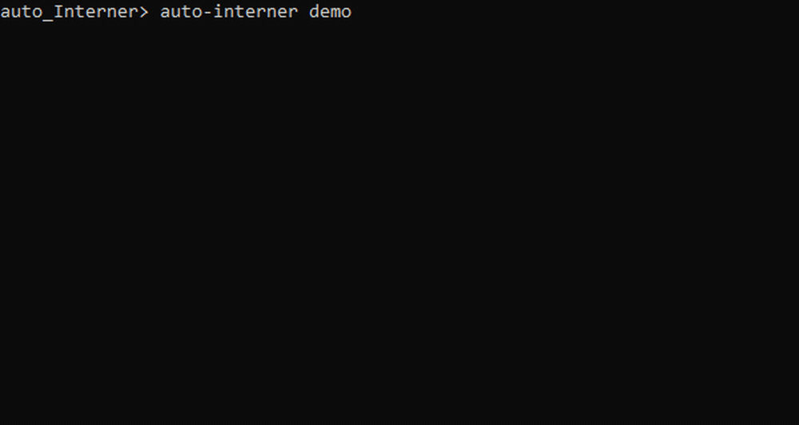

# auto_Interner — working context for Claude Code

## Current state — read this first

```
auto_Interner    2 of 4 Definition-of-Done boxes complete

  [x] 1. repo tidy + corpus merge finalised
  [x] 2. README reads as scoped-and-complete
  [ ] 3. demo GIF embedded and rendering        <- YOU ARE HERE
  [ ] 4. committed and pushed to origin/main
```

**22 changes are staged and uncommitted.** They are the boxes 1 and 2 work.
Review before committing; do not `git add -A` blindly.

Full scope snapshot, including what is deliberately excluded and why:
`../~~vaults~~/engineering_Journal/Projects/_Resume.md`

## What this is

A local, AI-assisted internship discovery and resume-tailoring pipeline. Finds
unseen listings, screens hard disqualifiers conservatively, prevents duplicate
work, and generates truthfully tailored DOCX resumes.

**Current goal: make this showcase-ready for internship applications.**
Not feature growth. Proof.

## Project state

Phases 0–7 complete. 260+ tests, ~93% coverage, full offline gate, arm64 image.

The pipeline already does the hard parts end to end:

```
snapshot → scan → fetch → deterministic screen → semantic screen
        → role dedupe → validated rewrite → DOCX assembly → atomic commit
```

### `auto_interner.corpus` — selection instead of generation

A second tailoring strategy, merged in from what was briefly a separate
`resume_Corpus` project. 750 lines, 14 tests, no new dependencies.

`rewriting/` validates model output *after* generation — reject any rewrite
that alters a metric, introduces a technology, or escalates a proficiency.
Sound, but adversarial: it holds only for the failure modes the validator
anticipates.

`corpus/` inverts that. The user maintains blocks they wrote and verified, and
tailoring selects a subset scored against extracted job requirements. The model
never authors a claim, so the worst case is a badly chosen *true* statement — a
ranking bug, not a credibility failure. The validator still guards the optional
rephrasing pass one layer down.

It also reports honest gaps: requirements nothing in the corpus supports are
named rather than filled.

Corpora are JSON (YAML works when PyYAML happens to be installed) so the
package adds no required dependency.

## Scope decision: Phase 8 is out of scope. Permanently.

Phase 8 was automatic application submission. **It is not being built, and that
is a decision, not a gap.**

Rationale, which belongs in the README:

- Automated submission violates the terms of service of most application portals.
- Auto-submitted applications get flagged as spam, which is worse than not applying.
- The expensive, error-prone work is *finding, screening, and tailoring*. That is
  done. Submission is three minutes of human review per application, and a human
  in that loop is correct design, not a limitation.

The project is complete at Phase 7 plus recruiter-facing proof. Treat it that way
in all docs. Do not describe it as unfinished.

## Remaining work

Phase 9 — recruiter-facing proof. Boxes 3 and 4 above are all that is left of
it, and both are assembly rather than construction.

## Working style — important

Sessions are short and intermittent. Follow these rules strictly:

1. **One task per session.** Never start the next without being asked.
2. **Every task ends shippable.** Stopping at any point leaves the repo better
   than before. No half-finished states across sessions.
3. **Propose, then wait.** Show the diff or plan before applying wide changes.
4. **No new dependencies, no refactors, no scope growth.** If you spot something
   worth changing outside the current task, note it in `docs/decisions.md`
   and move on.
5. **Keep existing conventions.** Fictional fixtures only, offline fakes at every
   boundary, no live calls in tests, claims in docs must match demonstrated
   behavior.
6. **If a task turns out bigger than its estimate, stop and say so** rather than
   pushing through. Re-scoping is cheaper than an abandoned branch.

## Box 3 — the demo GIF

**Being produced through the GAN_@gent harness**, as a real exercise of that
architecture rather than a toy spec.

```
GAN_@gent/harness/specs/demo-gif/
├── spec.md            <- paste THIS, whole, into ChatGPT. Nothing else.
└── grader/
    ├── criteria.md    <- builder never sees this
    └── verify.py      <- mechanical checks, stdlib only
```

**The isolation rule:** the builder gets `spec.md` and nothing more. Pasting any
part of `grader/` invalidates the run, and it will not be obvious afterwards
that it happened.

Setup, if needed:

```bash
pip install -e .
auto-interner demo
```

When the GIF comes back:

```bash
python "../GAN_@gent/harness/specs/demo-gif/grader/verify.py" docs/media/demo.gif
```

Exit 0 = mechanical checks pass · 1 = behaviour failure · 2 = contract failure.
Then watch it once for H1-H7 in `criteria.md`.

If it fails, report the check IDs back to the builder. **Do not fix it here** —
a grader that repairs the artifact has become the builder.

Then embed at the top of `README.md`, under the title:

```markdown

```

## Before box 4 — run the repo audit

The harness also grades this repository, not just the GIF.

```bash
python "../GAN_@gent/harness/specs/repo-audit/grader/audit.py" .
```

17 checks across structure, security, claims, and docs. Exit 0 pass · 1
behaviour · 2 contract.

**The CLAIMS section verifies what the README tells a stranger.** "260+ tests"
is checked by counting test functions. "Cannot lie about you" and "contact data
never reaches the model" are checked by *running* those tests — a truthfulness
guarantee backed by a test that does not execute is not a guarantee.

Known state as of 2026-08-18, audited on Python 3.10 (below this project's
floor, so CLAIMS were partly unassessable):

| | |
|---|---|
| S3 | `finalize.sh` and `restructure.sh` are stale — delete them |
| D3 | demo GIF missing — that is box 3 |
| K4 | could not be collected on 3.10. **On your 3.14 it should pass** — re-run and confirm |

Everything else passed, including both history-secret checks.

## Box 4 — commit and push, manually

Do this yourself. Read each step; do not paste the block wholesale.

```bash
cd auto_Interner

# 1. See exactly what is staged. 22 changes from boxes 1 and 2.
git status

# 2. Read the diff. This is the step that catches mistakes.
git diff --cached --stat

# 3. Confirm nothing sensitive is going up.
git diff --cached --name-only | Select-String -Pattern "\.env|secret|credential|\.key$"
#    (PowerShell. In Git Bash use: grep -Ei '\.env|secret|credential|\.key$')
#    No output = clean.

# 4. Add the GIF once it exists.
git add docs/media/demo.gif README.md

# 5. Commit.
git commit -m "Scope at Phase 7, add corpus selection, tidy docs, add demo"

# 6. Push.
git push origin main
```

Remote is already set: `https://github.com/WeedenAndrew/auto_Interner.git`
Branch is `main`. There is 1 local commit ahead of nothing — this is the first
push of this work.

**Step 3 is not optional.** It has never caught anything in this repo, and that
is exactly why it is easy to skip.

## Explicitly NOT in scope

Do not propose these. They were excluded deliberately, and re-proposing them
without quoting this section is scope drift:

- **Phase 8 / automatic submission** — cut. Portal ToS, spam-flagging,
  human-in-loop is correct design. Superseded by `Curat0r`.
- **Claim-audit table, evaluation results, architecture diagram** — all good,
  none required. Excluded from the DoD so they cannot become requirements.
- **Anything further in `src/auto_interner/corpus/`** — merged, tested, done.
- **New dependencies.** The package has exactly one: `python-docx`.

## Known issues, non-blocking

- `finalize.sh` and `restructure.sh` are now redundant — a PowerShell cleanup
  did both jobs. Safe to delete.
- `pytest` is not installed on the system Python 3.14. Corpus tests run with
  `PYTHONPATH=src python -m pytest tests/unit/test_corpus_selection.py -q`
  once it is.

## Copy-paste prompts

Open Claude Code in this folder and paste one line.

```
Read CLAUDE.md. I'm on box 3, the demo GIF. Give me the exact commands, one at a time.
```
```
Read CLAUDE.md. The GIF is recorded and in docs/media/. Embed it in the README and show me the diff.
```
```
Read CLAUDE.md. Show me git status and explain what's staged before I commit anything.
```

### Ten-minute version

For a low-capacity day, this alone moves it forward:

```
Read CLAUDE.md. Run the demo so I can watch it work. Just the commands, one at a time.
```

## Output style

Plain words. One action at a time. Explicit stop at the end.

Do not stack a second task onto a finished one. Do not assume the previous
message is held — restate rather than referring back to it.

Correctness, verification, and warnings are unchanged by this. Simplifying
delivery is not lowering the bar.
